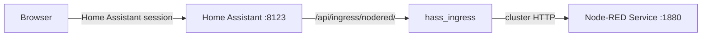

# Expose Kubernetes applications in Home Assistant

*Ecosystem guide — how hass_ingress works with the operator to put an independently deployed application in the Home Assistant sidebar. Not part of the operator's supported API.*

Deploy applications with their own Helm chart, operator, or manifests, then use
[`hass_ingress`](https://github.com/lovelylain/hass_ingress) to present their web
interface through Home Assistant. The application remains an ordinary Kubernetes
workload; Home Assistant provides the sidebar entry, authenticates the user, and
proxies requests through its own external URL.

!!! note "Not part of the supported API"
    This guide shows one way to integrate the operator with another tool in the
    Kubernetes ecosystem. Unlike the rest of this documentation, it is **not**
    part of the operator's supported API — it reflects the state at the time of
    writing and may need adjusting for a different tool version or cluster setup.

**Tested with**: hass_ingress 1.3.2, Home Assistant 2026.9.2, operator
1.4.0-rc.0, Node-RED 5.0.7, and Kubernetes 1.34.

## What this gives you



- A sidebar entry for the application.
- Home Assistant authentication in front of the proxied application, optionally
  restricted to Home Assistant administrators.
- Access through the Home Assistant origin and port, without a separate public
  Ingress or Gateway route for the application.
- Independent application lifecycle management with Kubernetes-native tooling.

This is not a Supervisor add-on implementation. The operator does not install or
configure an application from add-on metadata, manage its updates, or provide a
`SUPERVISOR_TOKEN`. If the application needs the Home Assistant API, configure
its credentials separately and do not reuse the operator's bootstrap token.

## Prerequisites

- A running Home Assistant instance with
  [bootstrap completed](../how-to/bootstrap-instance.md). The operator needs its
  API token to register `hass_ingress`.
- An existing `HomeAssistantConfiguration` for the instance.
- An application with an HTTP `Service` that the Home Assistant pod can reach,
  or permission to deploy the Node-RED example below.
- Outbound DNS and HTTPS access from the Home Assistant pod to
  `codeload.github.com`, where the repository archive is downloaded.

The examples put Home Assistant and Node-RED in the `homeassistant` namespace and
name the Home Assistant resource `home`. Change all names consistently if your
installation differs.

## Deploy the Node-RED backend

This deployment contains only the fields needed to start Node-RED and expose it
inside the cluster. A Service defaults to `ClusterIP`, so it does not create a
public Ingress or Gateway route:

```yaml
apiVersion: apps/v1
kind: Deployment
metadata:
  name: node-red
  namespace: homeassistant
spec:
  selector:
    matchLabels:
      app: node-red
  template:
    metadata:
      labels:
        app: node-red
    spec:
      containers:
        - name: node-red
          image: docker.io/nodered/node-red:5.0.7-24
---
apiVersion: v1
kind: Service
metadata:
  name: node-red
  namespace: homeassistant
spec:
  selector:
    app: node-red
  ports:
    - port: 1880
```

```sh
kubectl apply -f node-red.yaml
kubectl rollout status deployment/node-red -n homeassistant
```

!!! warning "Add persistent storage for real use"
    This small example does not mount a volume. All flows, installed nodes, and
    settings under `/data` are lost when the pod is replaced. For a real
    installation, mount a PersistentVolumeClaim at `/data` as described in the
    Node-RED documentation on
    [using a data volume](https://nodered.org/docs/getting-started/docker#using-a-data-volume).

The Service is now available to Home Assistant as
`node-red.homeassistant.svc.cluster.local:1880`. Keep it internal; the later
`hass_ingress` configuration provides the user-facing route.

## Install hass_ingress

Install the custom integration directly from its HACS-compatible repository. A
pinned tag makes upgrades deliberate and reproducible:

```yaml
apiVersion: ha.homeassistant.io/v1alpha1
kind: HomeAssistantCommunityRepository
metadata:
  name: hass-ingress
  namespace: homeassistant
spec:
  homeAssistantRef:
    name: home
  category: integration
  repository: lovelylain/hass_ingress
  ref: 1.3.2
```

`HomeAssistantCommunityRepository` is an experimental `v1alpha1` resource with
no API stability guarantee. Installing an integration causes the operator to
restart Home Assistant so that the custom component becomes available.

Apply the resource and wait for both the repository and the restarted Home
Assistant pod:

```sh
kubectl apply -f hass-ingress.yaml
kubectl wait hacr/hass-ingress -n homeassistant \
  --for=condition=Ready --timeout=2m
kubectl rollout status statefulset/home -n homeassistant --timeout=5m
kubectl exec home-0 -n homeassistant -c home-assistant -- \
  test -f /config/custom_components/ingress/manifest.json
```

Do not continue until the final command succeeds. A repository can be validated
before its files are downloaded into the Home Assistant volume. If the file is
missing, inspect the init container before restarting the pod:

```sh
kubectl logs home-0 -n homeassistant -c community-repository-init
```

## Register the integration

Create its Home Assistant config entry and select YAML configuration mode:

```yaml
apiVersion: ha.homeassistant.io/v1
kind: HomeAssistantIntegration
metadata:
  name: ingress
  namespace: homeassistant
spec:
  homeAssistantRef:
    name: home
  domain: ingress
  configuration:
    mode:
      value: yaml
```

```sh
kubectl apply -f ingress-integration.yaml
kubectl wait haint/ingress -n homeassistant \
  --for=condition=Ready --timeout=2m
```

The config flow cannot start until Home Assistant has loaded the custom
component, which is why the repository is installed and checked first.

## Add the application to the sidebar

Add an `ingress` section to the `spec.configuration` of your existing
`HomeAssistantConfiguration`. Preserve the rest of that resource: it is the
source of truth for the complete `configuration.yaml`.

```yaml
apiVersion: ha.homeassistant.io/v1
kind: HomeAssistantConfiguration
metadata:
  name: home
  namespace: homeassistant
spec:
  homeAssistantRef:
    name: home
  configuration: |
    default_config:

    ingress:
      nodered:
        title: Node-RED
        icon: mdi:sitemap
        require_admin: true
        url: http://node-red.homeassistant.svc.cluster.local:1880
```

`nodered` is the panel name and becomes part of its proxy path. The default
`work_mode` is `ingress`, which makes Home Assistant proxy the application. Keep
`require_admin: true` for administrative interfaces; set it to `false` only when
every authenticated Home Assistant user should have access.

Use the Service DNS name rather than a pod IP. For an application in another
namespace, use
`<service>.<namespace>.svc.cluster.local:<port>` and ensure any `NetworkPolicy`
allows traffic from the Home Assistant namespace.

## Restrict direct backend access

Home Assistant authenticates the browser request, but the application Service is
still directly reachable from workloads allowed by the cluster network. Do not
publish a separate Ingress, Gateway route, LoadBalancer, or NodePort unless users
are also meant to bypass Home Assistant.

If your cluster enforces network policies, allow only the Home Assistant pod to
connect to the backend. This same-namespace example relies on the stable labels
applied to operator-managed Home Assistant pods:

```yaml
apiVersion: networking.k8s.io/v1
kind: NetworkPolicy
metadata:
  name: node-red-from-home-assistant
  namespace: homeassistant
spec:
  podSelector:
    matchLabels:
      app: node-red
  policyTypes:
    - Ingress
  ingress:
    - from:
        - podSelector:
            matchLabels:
              app.kubernetes.io/name: homeassistant
              app.kubernetes.io/instance: home
      ports:
        - protocol: TCP
          port: 1880
```

NetworkPolicy enforcement requires a compatible CNI. Adapt both selectors when
your application chart uses different labels.

## Verify

Wait until both custom resources report ready:

```sh
kubectl get hacr hass-ingress -n homeassistant
kubectl get haint ingress -n homeassistant
kubectl get haconfig home -n homeassistant
```

Expected readiness indicators are:

```text
NAME           CATEGORY      PHASE       READY
hass-ingress   integration   Installed   True

NAME      DOMAIN    READY
ingress   ingress   True

NAME   STRATEGY   READY
home   auto       True
```

Sign in to Home Assistant and select **Node-RED** in the sidebar. The browser URL
stays on the Home Assistant origin and the application is served below
`/api/ingress/nodered/`. Confirm that opening the application Service outside
that path is impossible from an untrusted network.

## Compatibility limitations

The backend must work below a URL prefix. Applications that emit absolute URLs,
set cookies for incompatible paths, enforce their own origin, or reject proxied
WebSocket connections may need application-specific base-path settings or
`hass_ingress` rewrite rules. Some applications cannot be made compatible; use a
separate route with its own authentication proxy for those applications.

`hass_ingress` can inject headers for a backend that requires them. Store header
credentials in Home Assistant `secrets.yaml` through
[`HomeAssistantSecrets`](../how-to/manage-secrets.md), then reference them with
`!secret` rather than putting credentials directly in
`HomeAssistantConfiguration`.

## Security considerations

`hass_ingress` runs inside Home Assistant and forwards authenticated requests to
another workload. Treat its version as security-sensitive, pin `spec.ref`, review
changes before upgrading, and restrict the Service with network policy. An
application without its own authentication is safe only while every alternate
network path to it remains closed.

Avoid the `static_token` feature for normal sidebar access: it creates a URL that
bypasses Home Assistant login until the token is changed. Header-based automatic
login similarly gives the Home Assistant process possession of the backend
credential, so grant that credential only the permissions the embedded UI needs.

## See also

- [Install HACS-compatible extensions](../how-to/install-community-repositories.md)
- [Register integrations](../how-to/register-integrations.md)
- [Manage configuration.yaml declaratively](../how-to/manage-configuration.md)
- [hass_ingress configuration](https://github.com/lovelylain/hass_ingress#configuration)
